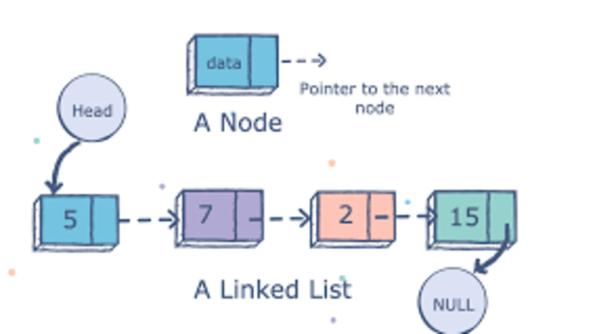

# Linked List
Like many data structures, such as arrays or lists, the linked list is a linear data structure. This means that each item is connected to one value in front of it and one value behind. Unlike arrays though, the items in a linked list are not stored in the same location. New values that are added are linked to the previous values by a pointer. 

The advantages of a linked list include dynamic size and quick insertion/deletion. A linked list has each value held at a different location, so it can grow as long is there is available space. It can also add or remove items from within the list by replcaing the referenced node with a new node when adding or the next node when deleteing.

The disadvantages include slower searching functions and an overall increase in size since each node requires a variable to hold the value and another for the next pointer. Since each item in a linked list is refernced by a pointer, we cannot do a bianary search, which would be O(1), and instead have to loop until they find the value, which is O(n).

## Linked List Methods
THe methods available when using a linked list differ depending on the structure it was built with. In Python, there are no native libraries that impiment a linked list, but you can build a linked list class yourself, utilize a `deque` from `from collections import deque`, or look up a library you can import and utilize their linked lists.

### Insert
The insert method pertains to three mains types of methods, adding an item to the end of the list, adding an item to the front of the list, and inserting an item into the list after a specified value.

### Remove
The remove function has two main parts as well. First being remove the first instance of the value, and second being remove all instances of the value. 

## Example: 
For this example, here is an [example](linked_list_incomplete.py) of a linked list that can be built and used in Python. A majority of this class has copyright by BYUI, and as such make no claim to the code. I have included a few changes and implimented some functions. 

## Problem to Solve: Limited Queue
Utilizing the example given above, add a function that removes all instances of the value, not just the first value. Then add a second funtion to add a list of items to the end of the linked list. Make sure to check if there are values in the list.

Once you have finished your implimentations of the two functions above, take a look at this possible [solution](linked_list_solution.py) and compare ways to solve the problems. 
