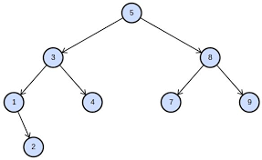

# Tree
A Tree is a non-linear data structure that uses nodes that branch from a root node. The branch nodes are attached based on a condition when the structure is created. In a Bianary Tree, the node is attached based on whether the value is greater or lesser than the current value. An example of a Tree in coding would the the computer file system. 

In this lession, we will be looking at one of the most basic tree structures, the Binary Tree. It is call this because it has at most two child nodes. The nodes consist of the data stored and two pointers. These pointer point to the next node below it, making it look like a tree. In the image below, we can see a parent node(the circle at the top containing 5) and the barnches down to each nod below it. This tree adds the next value based off of the top nodes value. If it is less than the value, it branches to the left, and if it is greater than the value, it branches to the right. This is one of the main benifits of a tree. It has a similar space complexity of a linked list, but has a faster search function as it uses checks to finds values.

## Tree Methods

### Enqueue
Enqueue adds an item to the end of the queue. This method has essesntially the same for withever data structure you use for your queue. For a list and deque, you can use ` append()`  and for a Queue it is `put()`.
### Dequeue
Dequeue removes the item that was added least recently from the list or queue and returns the value that was stored  in that place. This is essentially helping or getting the the next "person" in line, or the next item to be removed from the queue. To dequeue a list, use `pop(0)`, in a Queue us `pop()` without the 0, and for deque use `get()`

## Example: Haircut Queue

## Problem to Solve: Limited Queue
